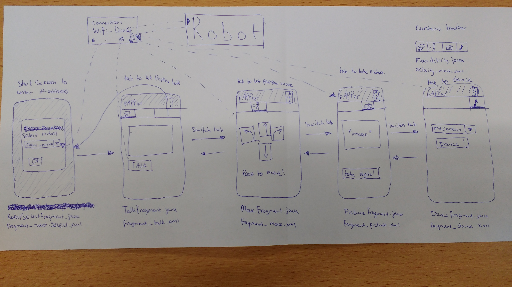

# Design document for pAPPer

Pieter Kronemeijer

This document describes in more detail how the app described in the README.md is going to be structured. 

## Advanced sketches of the UI

## Diagram of utility modules, classes and functions
<table>
  <tr>
    <td>RobotConnection</td>
  </tr>

  <tr>
    <td>currentConnection</td>
  </tr>

  <tr>
    <td>getConnections 
    connect 
    sendMove 
    sendTalk 
    sendDance 
    getImage</td>
  </tr>
</table>

## List of APIs, frameworks and plugins
- Pepper SDK for android
- Robot SDK and tools (including Qi SDK)

## List of data sources
- Keyframes that are provided with the operating system of the Pepper robot. Keyframes are lists of angle-time combinations, which correspond to a certain joint of the robot. If the joints are at the given points at the given times (interpolating between them), then the robot will perform a certain motion. I use these given keyframes to make the robot for example wave.

## Database tables
I do not intend to use a database.