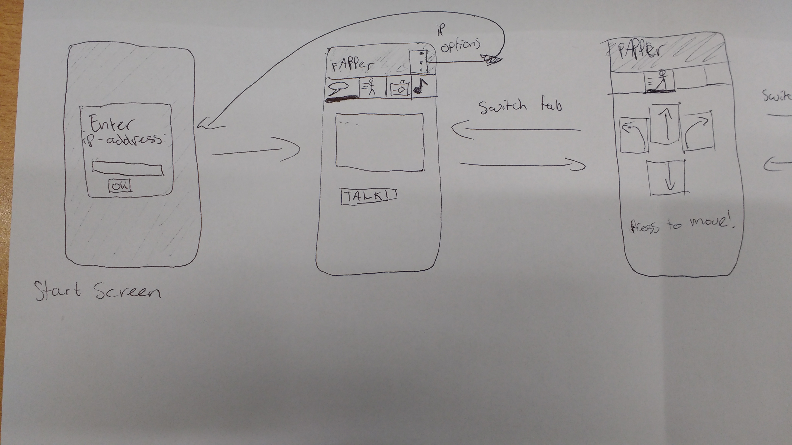
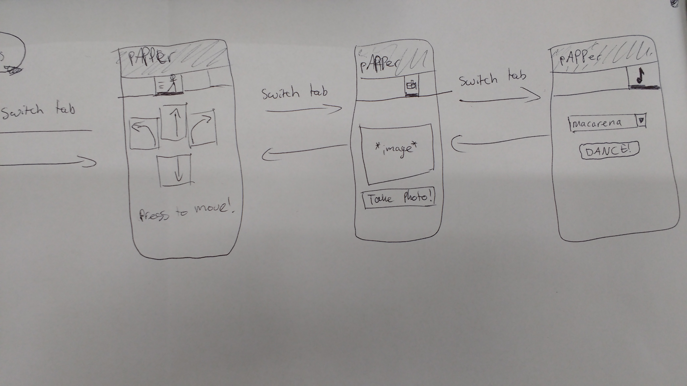

# pAPPer, an app to control Pepper

By Pieter Kronemeijer

This is an app that makes it easy to let the Pepper robot do basic movements and talking, without needing any coding experience.

## Problem Statement
The [Pepper robot](http://pepperrobothire.com/wp-content/uploads/2016/08/pepperhire1.png) is a relatively new social robot, meaning that it is not intended for lifting (heavy) objects or fast movement, but for 'interaction' with humans. However, for anybody without coding experience, like people visiting the robolab, it is hard to get the robot to do anything besides a small built-in demo.

## Solution
### Summary
An app that gives the user the option to control the Pepper robot from their phone, including movement, tablet and sounds.

To give robolab-visitors the option to use the pepper robot, I will make an app which allows for easy control and interaction with the Pepper. For a complete experience of the robot, the user can let the robot move location, toggle the so called 'autonomous life' (robot moves a bit and follows faces), show pictures on the tablet, let him say things and execute some standard actions, like vacuuming.

### Visual Sketch
<table>
  <tr>
    <td>
      Left part of sketch
      
    </td>
    <td>
      Right part of sketch
      
    </td>
  </tr>
</table>

### Main Features
(It is possible that not all of the planned features make it to the endproduct, depending on whether it is doable to implement these with the SDK, so I made two lists, 'definitely' and 'hopefully')

#### Definitely in the endproduct:
- Connection to the robot
- Letting Pepper speak (text to speech)
- Telling Pepper to do a (predetermined) motion, like waving
- Moving Pepper (turn and move)

#### Hopefully in the endproduct:
- Showing pictures on the screen of the tablet
- "Intelligent" interaction (talking) with pepper (built-in version)
- Showing camera image taken by Pepper
- Custom joint setting (specifically entering a number as degrees for for example the arm joint)
- Autonomous life

## Prerequisites
### external components
-Android SDK for Pepper, which is for connection of the tablet to the robot (https://android.aldebaran.com/sdk/doc/pepper-sdk/index.html)connection of tablet to robot.
-Qi SDK for Pepper, which is for triggering motions (like waving), which are provided in the operating system of the robot (called NaoQi) (https://android.aldebaran.com/sdk/doc/pepper-sdk/api.html)

### Review similar app
There is one similar app, which is made last year by Caitlin Lagrand. It is an app which is made for the Nao robot. With this app you can connect to a server (via a wifi hotspot, to which the Nao is connected as well). Then you can make the Nao robot walk, turn, speak, dance and take a picture. 

The connection part in that app is different from the way I intent to implement it. I won't use a server, but instead connect to the robot via the SDK with a direct wifi connection. 

The layout of Caitlin's app is with the use of tabs, one for every feature (walking, speaking, etc.). This is convenient and I will make it similar. One exception is the "connection" part, where you have to specify the ip-address of the robot. I will make it a button in an options menu on top instead of a separate tab (since you only need it once). 

Another thing is that Caitlin's app crashes frequently on most phones, so I will try to make it more stable.

### Hardest parts
I think the hardest part is make the app stable in combination with the communication of the phone to the robot, since it is a non-standard thing to do (since there is already a tablet on the Pepper itself). The app should also keep running when the robot stops responding for a while, which happens a lot, and detect when this happens in order to not send too many commands.

